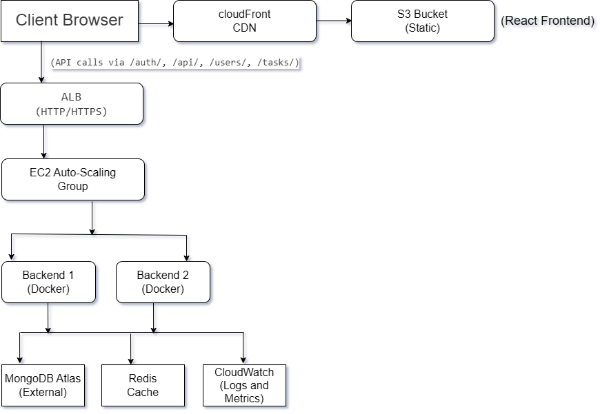

# 🏗️ Architecture

## Overview

This application is a full-stack todo platform composed of a React frontend, a Go backend, and supporting infrastructure for caching and persistence.

> This document is written in a GitHub-friendly format using plain Markdown and an ASCII diagram so it renders reliably on GitHub.

### Core components

- **Frontend**: React + TypeScript user interface
- **Backend**: Go + Gin REST API
- **Cache**: Redis 7
- **Database**: MongoDB 7
- **Local orchestration**: Docker Compose

## Architecture diagram

## Request flow

The frontend is served from S3 through CloudFront, which also proxies API requests to the Application Load Balancer (ALB). The ALB distributes traffic to a fleet of EC2 instances running the Go backend inside Docker containers. The backend connects to MongoDB Atlas for persistent storage and to ElastiCache Redis for caching/sessions. All logs and metrics flow into CloudWatch.

## Deployment view

- **Local development**: Docker Compose starts the frontend, backend, Redis, and MongoDB containers.
- **Production path**: The README describes an AWS deployment flow using S3, CloudFront, ALB, EC2, and ECR.

